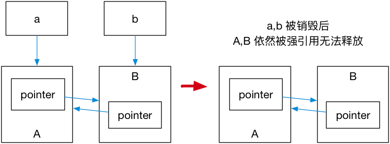
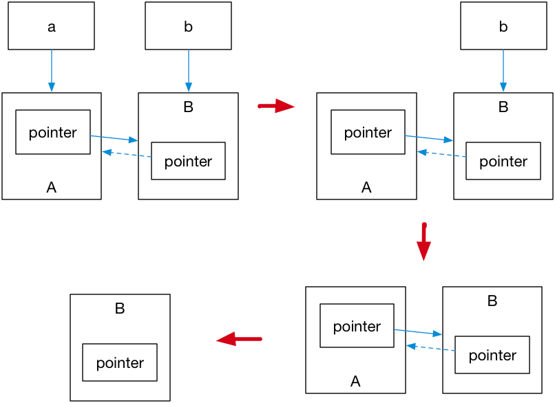

### 学习C++智能指针

* 使用它们需要包含头文件 <memory>

### 一共有三类

* shared_ptr ： 是一种智能指针，它能够记录多少个 shared_ptr 共同指向一个对象，从而消除显式的调用 delete，当引用计数变为零的时候就会将对象自动删除。
* unique_ptr ：是一种独占的智能指针，它禁止其他智能指针与其共享同一个对象，从而保证代码的安全：
* weak_ptr ： 没有 * 运算符和 -> 运算符，所以不能够对资源进行操作，它可以用于检查 std::shared_ptr 是否存在，其 expired() 方法能在资源未被释放时，会返回 false，否则返回
  true；除此之外，它也可以用于获取指向原始对象的 std::shared_ptr 指针，其 lock() 方法在原始对象未被释放时，返回一个指向原始对象的 std::shared_ptr
  指针，进而访问原始对象的资源，否则返回nullptr。

#### 主要函数

* make_xxx<>()       : 创建一个xx 类型的指针
* xxx.use_count()    : 获取指针的引用次数
* xxx.reset()        : xxx 指针的引用计数 -1; and the same time ,也能往 reset(* new_pointer) 中 添加一个新的指针；

### shared_ptr

### unique_ptr

> 一种独占的智能指针，它禁止其他智能指针与其共享同一个对象，从而保证代码的安全：

```c++
std::unique_ptr<int> b_pointer = std::make_unique<int>(10); // make_unique 从 C++14 引入
std::unique_ptr<int> pointer2 = b_pointer; // 
```

* make_unique 并不复杂，C++11 没有提供 std::make_unique，可以自行实现：

```c++
template<typename T, typename ...Args>
std::unique_ptr<T> make_unique( Args&& ...args ) {
  return std::unique_ptr<T>( new T( std::forward<Args>(args)... ) );
}
```

* 既然是独占，换句话说就是不可复制。但是，我们可以利用 std::move 将其转移给其他的 unique_ptr

```c++
#include <iostream>
#include <memory>

struct Foo {
    Foo() { std::cout << "Foo::Foo" << std::endl; }
    ~Foo() { std::cout << "Foo::~Foo" << std::endl; }
    void foo() { std::cout << "Foo::fun_1" << std::endl; }
};

void f(const Foo &) {
    std::cout << "f(const Foo&)" << std::endl;
}

int main() {
    std::unique_ptr<Foo> p1(std::make_unique<Foo>());
    // p1 不空, 输出
    if (p1) p1->fun_1();
    {
        std::unique_ptr<Foo> p2(std::move(p1));
        // p2 不空, 输出
        f(*p2);
        // p2 不空, 输出
        if(p2) p2->fun_1();
        // p1 为空, 无输出
        if(p1) p1->fun_1();
        p1 = std::move(p2);
        // p2 为空, 无输出
        if(p2) p2->fun_1();
        std::cout << "p2 被销毁" << std::endl;
    }
    // p1 不空, 输出
    if (p1) p1->fun_1();
    // Foo 的实例会在离开作用域时被销毁
}

```

* unique_ptr 是可以使用move,哈哈哈，，如下图，你懂的：
  .png)
* unique_ptr 指针采用 std::default_delete<T> 方法释放堆内存。

### weak_ptr : 它的最大作用在于协助shared_ptr工作， 像旁观者那样观测资源的使用情况。

* 仔细思考 std::shared_ptr 就会发现依然存在着资源无法释放的问题。看下面这个例子：

```c++

#include
<iostream>
#include
<memory>

using namespace std;
struct A;
struct B;

struct A {
std::shared_ptr<B> b_pointer;

~A() {
std::cout << "A 被销毁" << std::endl;
}
};

struct B {
std::shared_ptr<A> b_pointer;

~B() {
std::cout << "B 被销毁" << std::endl;
}
};


```


* 解决这个问题的办法就是使用 **弱引用指针** std::weak_ptr
* 弱引用不会引起引用计数增加，当换用弱引用时候，最终的释放;


* 最后一步只剩下 B，而 B 并没有任何智能指针引用它，因此这块内存资源也会被释放。
* expired() : 通过调用 std::weak_ptr 类提供的 expired() 方法来判断观测的资源是否已经被释放
> weak_ptr 监测的就是 shared_ptr 管理的资源，当共享智能指针调用 shared.reset(); 之后管理的资源被释放，因此 weak.expired() 函数的结果返回 true，表示监测的资源已经不存在了。
* lock()
> 通过调用 std::weak_ptr 类提供的 **lock()** 方法来获取管理所监测资源的 shared_ptr 对象


### 参考：

* https://changkun.de/modern-cpp/zh-cn/05-pointers/#5-2-std-shared-ptr
* https://learn.microsoft.com/zh-cn/cpp/cpp/how-to-create-and-use-unique-ptr-instances?view=msvc-170
* [智能指针（现代 C++）](https://learn.microsoft.com/zh-cn/cpp/cpp/smart-pointers-modern-cpp?source=recommendations&view=msvc-170)
