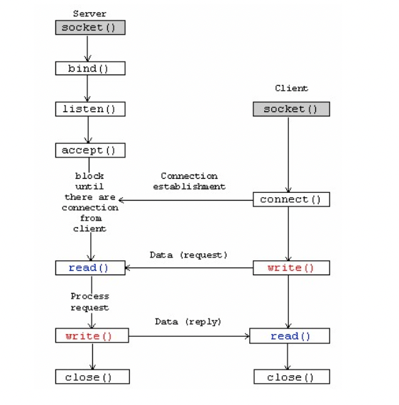

## socket()
```c++
int socket(int domain, int type, int protocol);
```

### 参数:

* domain: 即协议域，又称为协议族（family）。

  * 常用的协议组有：

  * AF_INET（ipv4地址（32位的）与端口号（16位的）的组合）
  * AF_INET6（ IPv6 的地址族）
  * AF_LOCAL（或称AF_UNIX，Unix域socket）（用一个绝对路径名作为地址）
  *  AF_ROUTE
* type: 指定socket类型。

  * 常用的socket类型有：
    * SOCK_STREAM
    * SOCK_DGRAM
    * SOCK_RAW
    * SOCK_PACKET
    * SOCK_SEQPACKET等等
* protocol：指定协议。

  * 常用的协议有：

    * IPPROTO_TCP（TCP传输协议）
    * IPPTOTO_UDP（UDP传输协议）
    * IPPROTO_SCTP（STCP传输协议）
    * IPPROTO_TIPC等（TIPC传输协议）
* Return Value
      成功產生socket時，會返回該socket的檔案描述符(socket file descriptor)，我們可以透過它來操作socket。若socket創建失敗則會回傳-1(INVALID_SOCKET)。

### 举例
* [RTMP_Connect0()](https://github.com/TopBigOne/FFmpegAndroid/blob/master/Live/src/main/cpp/rtmp/rtmp.c)
```c
r->m_sb.sb_socket = socket(AF_INET, SOCK_STREAM, IPPROTO_TCP);
```
## bind() : 赋予地址和端口
```c++
int bind(int sockfd, const struct sockaddr *addr, socklen_t addrlen);
```

### 参数

* sockfd: 即socket描述字，它是通过socket()函数创建了，唯一标识一个socket。bind()函数就是将给这个描述字绑定一个名字。

* addr: 一个const struct sockaddr *指针，指向要绑定给sockfd的协议地址
* addrlen：地址的长度。
> 通常服务器在启动的时候都会绑定一个众所周知的地址（如ip地址+端口号），用于提供服务，客户就可以通过它来接连服务器；而客户端就不用指定，有系统自动分配一个端口号和自身的ip地址组合。这就是为什么通常服务器端在listen之前会调用bind()，而客户端就不会调用，而是在connect()时由系统随机生成一个。

## listen()
```c++
int listen(int sockfd, int backlog);
```
* 参数：
  * sockfd:：即socket描述字，唯一的id。
  * backlog：相应socket可以排队的最大连接个数。

## connect()
```c++
int connect(int sockfd, const struct sockaddr *addr, socklen_t addrlen);
```
* 参数：
  * sockfd：socket描述符。
  * addr：服务器的socket地址。
  * addrlen：socket地址的长度

## accept()取接收请求
```c++
int accept(int sockfd, struct sockaddr *addr, socklen_t *addrlen);
```
* 参数：
  * sockfd：服务器的socket描述字。
  * addr：指向struct sockaddr *的指针，用于返回客户端的协议地址。
  * addrlen：协议地址的长度。

## send()
```c++
int send(int sockfd, const void *msg, int len, int flags);
```
* 参数：
  * sockfd：想要发送数据的套接字描述符。
  * msg：指向发送的消息数据的指针。
  * flags：一般设置为0.


## recv()
```c++
int recv(int sockfd, void *buf, int len, unsigned int flags);

```
* 参数：
  * sockfd：要读的套接字描述符。
  * buf：读取数据的缓冲区。
  * len：缓冲区的最大长度。
  * flags：一般设置为0.

## sendto()
```c++
int sendto(int sockfd, const void *msg, int len, unsigned int flags,
			const struct sockaddr *to, int tolen);

```
* 参数 
  * to 是个指向数据结构 struct sockaddr 的指针，它包含了目的地的 IP 地址和端口信息。
  * tolen 可以简单地设置为 sizeof(struct sockaddr)。


## 参考
* [TCP Socket Programming 學習筆記](https://zake7749.github.io/2015/03/17/SocketProgramming/)
* [C++ Socket编程（基础）](https://www.cnblogs.com/MaxLij/p/14584187.html) 

